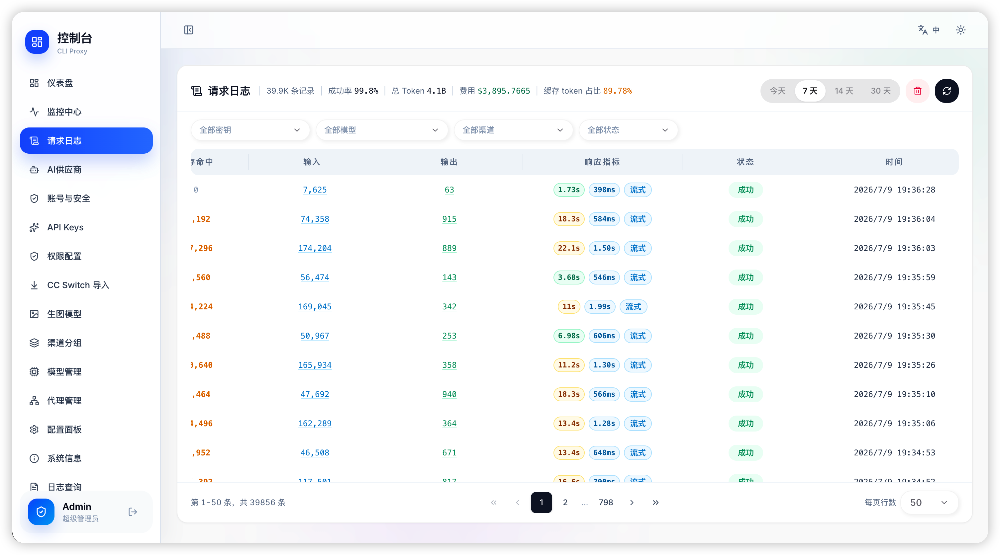
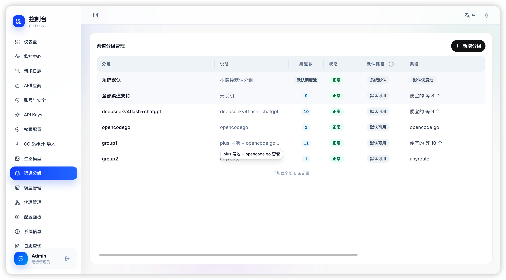
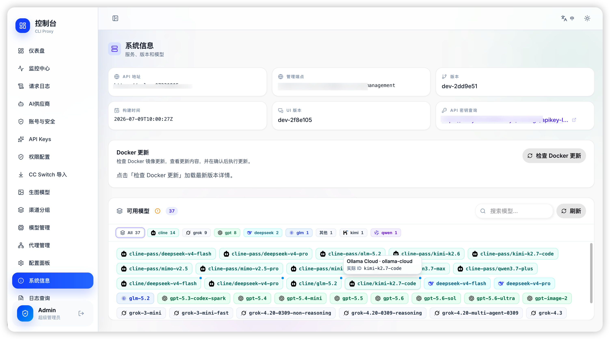
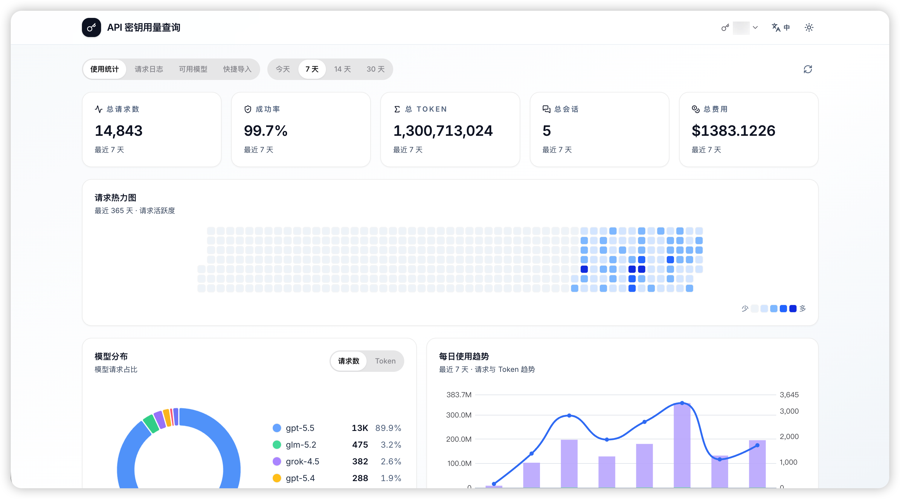

<p align="center">
  
  
  
  
</p>

<h1 align="center">🔀 CliRelay</h1>

<p align="center">
  <strong>A unified proxy server for AI CLI tools — use your <em>existing</em> subscriptions with any OpenAI / Gemini / Claude / Codex compatible client.</strong>
</p>

<p align="center">
  Multi-tenant web panel · request logs & quotas · routing groups & failover · self-hosted
</p>

<p align="center">
  English | <a href="README_CN.md">中文</a>
</p>

<p align="center">
  <a href="https://help.router-for.me/">📖 Docs</a> ·
  <a href="https://github.com/kittors/codeProxy">🖥️ Management Panel</a> ·
  <a href="https://github.com/kittors/CliRelay/issues">🐛 Report Bug</a> ·
  <a href="https://github.com/kittors/CliRelay/pulls">✨ Request Feature</a>
</p>

<p align="center">
  
</p>

---

## ⚡ What is CliRelay?

> **✨ Heavily enhanced fork of the [CLIProxyAPI](https://github.com/router-for-me/CLIProxyAPI) project** — rebuilt with a production-grade management layer, web control panel hosting, and a terminal TUI for day-2 operations.

CliRelay turns AI CLI subscriptions, OAuth credentials, API keys, and compatible upstream services into one managed API layer. It proxies Claude Code, Gemini CLI, OpenAI Codex, Qwen, iFlow, Kimi, Antigravity, xAI/Grok, OpenCode Go, ClinePass, Ollama Cloud, Bedrock, Amp, Vertex, OpenAI-compatible clients, and other AI coding tools through a unified endpoint, then adds routing groups, failover, request logging, quota control, model pricing, image-generation support, content moderation, online updates, `/manage` web hosting, and terminal management workflows around that traffic.

It is built to be **operated by more than one person**. Tenants, users, roles, and a fine-grained permission model (`governance.tenants`, `models.write`, `providers.test`, …) decide which pages, buttons, and actions each account gets, and every security-sensitive change lands in an audit log. Portal accounts let end users hold several API keys under one identity and check their own usage without an admin in the loop.

The current runtime data stack is PostgreSQL 15+, Redis 7+, and Ent ORM. PostgreSQL is the source of truth for runtime data; Redis is used for cache, locks, limits, queues, and rebuildable state.

```
┌───────────────────────┐         ┌──────────────┐         ┌────────────────────┐
│   AI Coding Tools     │         │              │         │  Upstream Providers │
│                       │         │              │ ──────▶ │  Google Gemini      │
│  Claude Code          │ ──────▶ │   CliRelay   │ ──────▶ │  OpenAI / Codex    │
│  Gemini CLI           │         │   :8317      │ ──────▶ │  Anthropic Claude  │
│  OpenAI Codex         │         │              │ ──────▶ │  Qwen / iFlow      │
│  Amp CLI / IDE        │         │              │ ──────▶ │  Antigravity/xAI   │
│  Any OAI-compatible   │         └──────────────┘         │  Vertex / Bedrock  │
└───────────────────────┘                                  │  OpenCode/Cline    │
                                                           │  Ollama / Amp      │
                                                           └────────────────────┘
```

## ✨ Key Features

### 🔌 Multi-Provider Proxy Engine

| Feature | Description |
|:--------|:------------|
| 🌐 **Unified Endpoint** | One `http://localhost:8317` fronts Gemini, Claude, Codex, Qwen, iFlow, Kimi, Antigravity, xAI/Grok, Vertex, Bedrock, OpenCode Go, ClinePass, Ollama Cloud, OpenAI-compatible upstreams, and Amp integration |
| ⚖️ **Smart Load Balancing** | Round-robin or fill-first scheduling across multiple API keys for the same provider |
| 🧭 **Group & Path Routing** | Bind channels into groups, restrict API keys to allowed groups, and expose custom path namespaces for teams or workloads |
| 🔄 **Auto Failover** | Automatically switches to backup channels when quotas are exhausted or errors occur |
| 🧠 **Multimodal Support** | Full support for text + image inputs, image-generation routing, function calling (tools), and streaming SSE responses |
| 🔗 **OpenAI-Compatible** | Works with any upstream that speaks the OpenAI Chat Completions protocol |

### 📊 Request Logging & Monitoring (PostgreSQL)

| Feature | Description |
|:--------|:------------|
| 📝 **Full Request Capture** | Every API request is logged to PostgreSQL with timestamp, model, tokens (in/out/reasoning/cache), latency, status, and source channel |
| 💬 **Message Body Storage** | Full request/response message content captured in compressed PostgreSQL storage, with separate retention for content vs. metadata |
| 🔍 **Advanced Querying** | Filter logs by API Key, model, status, time range with efficient pagination (LIMIT/OFFSET) |
| 📈 **Analytics Aggregation** | Pre-computed dashboards: daily trends, model distribution, hourly heatmaps, per-key statistics |
| 🏥 **Health Score Engine** | Real-time 0–100 health score considering success rate, latency, active channels, and error patterns |
| 📡 **WebSocket Monitoring** | Live system stats streamed via WebSocket: CPU, memory, goroutines, network I/O, DB size |
| 🗄️ **Ent + PostgreSQL** | Uses PostgreSQL 15+ as the runtime primary database with Ent-generated schema metadata |

### 🏛️ Multi-Tenancy & Governance

| Feature | Description |
|:--------|:------------|
| 🏢 **Tenant Lifecycle** | Create tenants and manage their lease periods; runtime data is scoped by tenant end to end |
| 👤 **User Management** | Manage the accounts inside the active tenant, with password policy and reset flows |
| 🎭 **Role Permissions** | Fine-grained resource.action permissions (`governance.tenants`, `models.write`, `providers.test`, …) decide which pages, buttons, and actions an account can reach |
| 🧾 **Audit Logs** | Security-sensitive account and tenant changes are recorded and reviewable in the panel |
| 🧭 **Menu Management** | Curate which navigation entries a tenant sees, keeping menus aligned with granted permissions |

### 🔐 API Key & Portal Accounts

| Feature | Description |
|:--------|:------------|
| 🔑 **API Key CRUD** | Create, edit, delete API keys via Management API — each with custom name, notes, and independent enable/disable toggle |
| 🧑‍💼 **Portal Accounts** | Group several API keys under one end-user account, so a person is managed once instead of key by key |
| 📊 **Per-Key Quotas** | Set max token / request quotas per key with automatic enforcement |
| 🔁 **Period Quota Resets** | Reset spending quotas for a chosen period, for a whole account or a single owned key |
| ⏱️ **Rate Limiting** | Per-key rate limiting (requests per minute/hour) |
| 🧩 **Permission Profiles** | Reusable profiles bind scoped channel access and model permissions to keys |
| 🔒 **Key Masking** | API keys are always displayed masked (`sk-***xxx`) in UI and logs |
| 🌍 **Public Lookup Page** | End users can query their own usage stats and request logs via a public self-service page (no login required) |

### 🔗 Provider Channel Management

| Feature | Description |
|:--------|:------------|
| 📋 **Multi-Tab Config** | Manage channels organized by provider type: Gemini, Claude, Codex, OpenCode Go, ClinePass, Ollama Cloud, Vertex, Bedrock, OpenAI Compatible, and Ampcode |
| 🏷️ **Channel Naming** | Each channel can have a custom name, notes, proxy URL, custom headers, and model alias mappings |
| 🧩 **Reusable Proxy Pool** | Maintain outbound proxy entries once and attach them to OAuth/auth channels when needed |
| ⏱️ **Latency Tracking** | Average latency (`latency_ms`) tracked per channel with visual indicators |
| 🔄 **Enable/Disable** | Individually toggle channels on/off without deletion |
| 🚫 **Model Exclusions** | Exclude specific models from a channel (e.g., block expensive models on backup keys) |
| 🧾 **Model Library Sync** | Maintain custom models and sync model IDs/pricing from OpenRouter for quota accounting |
| 📊 **Channel Stats** | Per-channel success/fail counts and model availability displayed on each channel card |

### 🛡️ Security & Authentication

| Feature | Description |
|:--------|:------------|
| 🔐 **OAuth Support** | Native OAuth flows for Gemini, Claude, Codex, Qwen, iFlow, Antigravity, Kimi, and xAI/Grok, plus device/browser/cookie variants where supported |
| 🪪 **Identity Fingerprints** | Centralize upstream identity metadata so providers receive consistent client fingerprints |
| 🧹 **Content Moderation** | Build reusable moderation profiles, test them against sample content, and bind them to AI accounts, provider keys, or a provider default |
| 🔒 **TLS Handling** | Configurable TLS settings for upstream communication |
| 🏠 **Panel Isolation** | Management panel access controlled independently with admin password |
| 🌐 **Scoped CORS** | Browser and extension callers are allowlisted explicitly, including a controlled `chrome-extension://*` form; the preflight advertises every auth header the server actually accepts |
| 🛡️ **Request Cloaking** | Upstream requests are stripped of client-identifying headers for privacy |

### 🛠️ Operator Experience

| Feature | Description |
|:--------|:------------|
| 🖥️ **Visual Management Panel** | Configure providers, auth, API keys, models, routing, logs, updates, and system status from `/manage` |
| 🌐 **Trilingual UI** | Built-in i18n for the management panel — Simplified Chinese, English, and Russian — plus Compose/TUI language selection |
| 🌙 **Dark Mode** | Full dark theme for long-running operational sessions |
| 🧬 **Visual Config Editor** | Edit runtime config visually or inspect source YAML when you need exact control |
| 🔄 **Online Update Flow** | Check versions, review update notes, trigger the updater sidecar, and wait for backend recovery from the panel |
| 📥 **CC Switch Presets** | Build reusable CC Switch provider configs from a channel group, map each Claude role (main / Haiku / Sonnet / Opus / Fable) or Codex model to a real upstream model, and hand out a one-click import link |
| 🛒 **Model Plaza** | Browse every model currently available to the active tenant in one place |

### 🗄️ Data Persistence

| Feature | Description |
|:--------|:------------|
| 💾 **PostgreSQL Storage** | Usage data, request logs, message bodies, API keys, routing, proxy pool, model config, and quota state are stored in PostgreSQL |
| 🔄 **Redis Runtime State** | Redis 7+ handles cache, locks, limits, queues, and rebuildable snapshots; PostgreSQL remains the source of truth |
| 🗃️ **Pluggable Auth/Config Backends** | Local files by default, with optional PostgreSQL, Git, or S3-compatible object storage backends for config/auth persistence |
| 📦 **Config Snapshots** | Import/export entire system configuration as JSON for backup and migration |

## 🛠️ Runtime & Tech Stack

| Layer | Technology |
|:------|:-----------|
| Runtime | Go 1.26, Gin, Docker Compose |
| Data | PostgreSQL 15+ via Ent ORM, Redis 7+ for rebuildable runtime state |
| Auth / Config Storage | Local files, PostgreSQL, Git, or S3-compatible object storage |
| Proxy Core | OpenAI Chat Completions / Responses, Anthropic Messages, Gemini, provider-specific executors, SSE and WebSocket paths |
| Operations | Bubble Tea / Lipgloss TUI, `/manage` web panel hosting, updater sidecar |
| Observability | PostgreSQL request logs, compressed message bodies, live logs, system stats WebSocket |

## 📸 Management Panel Preview

CliRelay can expose a built-in web control panel at `/manage`. The server can host bundled SPA assets or fall back to synced management assets from the configured panel repository.

The gallery below follows the panel's own navigation, captured from a live deployment.

### Observability

| Dashboard | Monitor center |
| :-------- | :------------- |
|  |  |

| Request logs | Runtime logs |
| :----------- | :----------- |
|  |  |

### Access & Credentials

| AI providers | AI accounts |
| :----------- | :---------- |
|  |  |

| Portal accounts | Portal account permissions |
| :-------------- | :------------------------- |
|  |  |

| Content moderation | CC Switch config |
| :----------------- | :--------------- |
|  |  |

### Models & Routing

| Model plaza | Model catalog |
| :---------- | :------------ |
|  |  |

| Image models | Channel groups |
| :----------- | :------------- |
|  |  |

| Outbound proxies |
| :--------------- |
|  |

### Organization

| Tenants | Tenant switcher |
| :------ | :-------------- |
|  |  |

| Users | Roles & permissions |
| :---- | :------------------ |
|  |  |

| Audit logs |
| :--------- |
|  |

### System & Self-Service

| Visual config editor | Menu management |
| :------------------- | :-------------- |
|  |  |

| System info | User portal |
| :---------- | :---------- |
|  |  |

| Public API key lookup |
| :-------------------- |
|  |

> 🔗 The runtime panel source is configurable via `remote-management.panel-github-repository`. The default repository is [kittors/codeProxy](https://github.com/kittors/codeProxy).

## 🏗️ Supported Providers

| Provider / Channel | Auth | Notes |
|:-------------------|:-----|:------|
| Google Gemini | OAuth + API Key | Gemini CLI / AI Studio style flows |
| Anthropic Claude | OAuth + API Key | Claude Code and Claude-compatible clients |
| OpenAI Codex | OAuth + API Key | Includes Responses and WebSocket bridging |
| Qwen | OAuth | Qwen Code style login flow |
| iFlow / GLM | OAuth + Cookie | Supports iFlow routing and related model families |
| Kimi | OAuth | Browser-based login flow |
| xAI / Grok | OAuth | Grok CLI-compatible OAuth and quota metadata |
| Antigravity | OAuth | Dedicated OAuth channel with model backfill support |
| Vertex-compatible endpoints | API Key | Custom base URL, headers, aliases, exclusions |
| AWS Bedrock | API Key / SigV4 | Region-aware Bedrock Runtime access with Claude model aliases |
| OpenCode Go | API Key | Fixed OpenCode Go upstream with usage query and vision fallback support |
| ClinePass | API Key | OpenAI-compatible ClinePass routing with model-access controls |
| Ollama Cloud | API Key | OpenAI-compatible Ollama Cloud routing with model-access controls |
| OpenAI-compatible upstreams | API Key | OpenRouter, Grok-compatible endpoints, and custom providers |
| Amp integration | Upstream API key + mappings | Direct Amp upstream fallback or mapped local routing |

## 🚀 Quick Start

### 🐳 Install With Docker Compose

Docker Compose is the recommended installation path for CliRelay. The included `docker-compose.yml` starts CliRelay, PostgreSQL 15, Redis 7, and the updater sidecar. A `.env` file is optional: the `clirelay-init` service creates it on the first `docker compose up -d`, generates missing secrets such as `CLIRELAY_UPDATER_TOKEN`, `CLIRELAY_ADMIN_PASSWORD`, and `CLIRELAY_POSTGRES_PASSWORD`, preserves existing non-empty values, and creates `config.yaml` from `config.example.yaml` if it is missing. `CLIRELAY_ADMIN_PASSWORD` bootstraps the first `admin` user in an empty database; the init script generates a compliant random value, or you can pre-set your own of at least 12 characters containing an upper-case letter, a lower-case letter, and a non-alphanumeric character. A pre-set value that does not meet those rules is replaced on the next start, because bootstrap would otherwise reject it and the container would not come up. For production, pre-create `.env` only when you want to pin your own secrets or bind paths.

```bash
git clone https://github.com/kittors/CliRelay.git
cd CliRelay
# Linux bind mounts need write access for the non-root container user:
# sudo chown -R 10001:10001 auths logs data
docker compose up -d
```

The application process runs as `10001:10001`. Ensure `config.yaml` is readable by that user; management-panel config saves also require write access. On Synology/DSM bind mounts, if the container entrypoint cannot apply `chown` because of the shared-folder ACL, fix the ACL/ownership on the host and restart `cli-proxy-api`.

After the first start, edit the generated `config.yaml` to add your API keys or OAuth credentials, then restart the service:

```bash
docker compose restart cli-proxy-api
```

By default, client API routes (`/v1`, `/v1beta`) require an API key. To run without client keys, set `allow-unauthenticated: true` in `config.yaml` (not recommended for production).

After startup:

- API endpoint: `http://localhost:8317`
- Web panel: `http://localhost:8317/manage`
- Logs: `docker compose logs -f cli-proxy-api`
- Restart: `docker compose restart cli-proxy-api`
- Stop: `docker compose down`
- TUI: `docker compose exec cli-proxy-api ./cli-proxy-api -tui`
- OAuth login modes: `docker compose exec cli-proxy-api ./cli-proxy-api -login`

Set `CLIRELAY_LOCALE=en` or `CLIRELAY_LOCALE=zh` in your Compose environment to control the default TUI language.

For cloud platforms that only allow one mounted directory, set `AUTH_PATH` to the authentication directory inside the container, for example `/CLIProxyAPI/auths`. `CLI_PROXY_AUTH_PATH` remains the host-side bind path, while `AUTH_PATH` is also used to override `auth-dir` at runtime.

To disable automatic update prompts, set the following in `config.yaml` or turn off **Automatic Update Checks** in the Config page:

```yaml
auto-update:
  enabled: false
```

Update checks follow the stable `main` Docker image by default. To test dev builds, set `channel: dev` in `config.yaml` or choose **Development (dev)** from **Update Channel** in the Config page:

```yaml
auto-update:
  channel: dev
```

### 🗄️ Runtime Data Stack

CliRelay uses PostgreSQL 15+, Redis 7+, and Ent ORM exclusively at runtime. PostgreSQL is the only source of truth for business data; Redis is limited to cache, locks, rate limits, queues, and rebuildable state.

The standard Docker Compose stack starts `clirelay-init`, PostgreSQL, Redis, the application container, and the updater sidecar.

The updater sidecar owns OTA task state and publishes it through SSE. The management panel renders only the updater-provided run ID, actual stage, completed steps, current and target backend/UI versions, target image, latest Release metadata, and final result; it no longer advances a timer-based percentage. If the API container restarts, the page reloads, or SSE disconnects briefly, the panel reconnects and receives the latest updater snapshot. Compose persists that snapshot in `.clirelay-updater-status.json`; if the updater itself restarts during a task, the interrupted task is explicitly marked failed instead of remaining stuck as running. After the application passes its health check, the current updater launches a detached helper from the target image; that helper safely recreates the updater sidecar so later OTA runs use the target updater implementation.

For large installations, tune `request-log-storage` in `config.yaml` to control full request/response body retention. Full body storage is disabled by default. When `store-content` is enabled, bodies are compressed, kept for 30 days, and capped at ~1GB (1024MB), while lightweight request metadata and request details remain available for statistics and troubleshooting. Set `content-retention-days: 0` to keep full bodies indefinitely. Disabling body storage from the management panel also clears historical input and output bodies while preserving request details and request records.

If you need non-local config/auth persistence, the server also supports PostgreSQL, Git-backed, and S3-compatible object-store backends through environment-based bootstrap settings.

### 3️⃣ Point Your Tools

Set your AI tool's API base to `http://localhost:8317` and start coding!

**Example: OpenAI Codex (`~/.codex/config.toml`)**
```toml
[model_providers.tabcode]
name = "openai"
base_url = "http://localhost:8317/v1"
requires_openai_auth = true
```

> 📖 **Full setup guides →** [help.router-for.me](https://help.router-for.me/)

## 🖥️ Management Panel

When the control panel is enabled, open:

```bash
http://localhost:8317/manage
```

- `remote-management.disable-control-panel` defaults to `false` in the example config, so the control panel is reachable after a standard Docker Compose deployment.
- When enabled, the current panel route is `/manage/login`. The old `management.html#/login` route is legacy-only.
- Docker Compose deployments expose the panel at `/manage`.
- The server can serve a bundled SPA directory or auto-fetch panel assets when needed.
- This repository contains the hosting/update path for `/manage`; the standalone web panel source is maintained separately from the Go server code.
- Make UI/interaction/copy changes in the panel source repository (default: `kittors/codeProxy`) and ship them via its release artifacts for the server to fetch.
- Terminal-first management is also available through `docker compose exec cli-proxy-api ./cli-proxy-api -tui`.
- If you want to customize the panel asset source, set `remote-management.panel-github-repository`.

## 📐 Architecture

```text
CliRelay/
├── cmd/server/               # Binary entry point and CLI mode dispatch
├── internal/api/             # HTTP server, management routes, middleware
├── internal/auth/            # Provider OAuth / cookie / browser auth flows
├── internal/config/          # Config parsing, defaults, migrations
├── internal/store/           # Local, Git, PostgreSQL, object-store auth/config persistence
├── internal/identity/        # Tenants, users, roles, permissions, menus, audit logs
├── internal/tui/             # Terminal management UI
├── internal/usage/           # PostgreSQL-backed usage data, retention, analytics
├── internal/managementasset/ # /manage panel hosting and asset sync
├── sdk/                      # Reusable Go SDK, handlers, executors
├── auths/                    # Local credential storage
├── examples/                 # SDK / custom provider examples
├── docs/                     # Local docs and panel screenshots
└── docker-compose.yml        # Container deployment entry
```

## 📚 Documentation

| Doc | Description |
|:----|:------------|
| [Getting Started](https://help.router-for.me/) | Full installation and setup guide |
| [Management API](https://help.router-for.me/management/api) | REST API reference for management endpoints |
| [Amp CLI Guide](https://help.router-for.me/agent-client/amp-cli.html) | Integrate with Amp CLI & IDE extensions |
| [SDK Usage](docs/sdk-usage.md) | Embed the proxy in Go applications |
| [SDK Advanced](docs/sdk-advanced.md) | Executors & translators deep-dive |
| [SDK Access](docs/sdk-access.md) | Authentication in SDK context |
| [SDK Watcher](docs/sdk-watcher.md) | Credential loading & hot-reload |
| [PostgreSQL / Redis Runtime](docs/postgres-redis-migration.md) | Runtime data-stack setup and validation |

## 🤝 Contributing

Contributions are welcome! Here's how to get started:

```bash
# 1. Clone the repository
git clone https://github.com/kittors/CliRelay.git
cd CliRelay

# 2. Create a feature branch from the latest dev baseline
git fetch origin
git switch -c feature/amazing-feature origin/dev

# 3. Make your changes & commit
git commit -m "feat: add amazing feature"

# 4. Push to your branch & open a PR targeting dev
git push origin feature/amazing-feature
```

Please target pull requests at `dev`, not `main`. Maintainers merge verified changes into `dev` first; `main` is updated separately for release/stable integration. See [CONTRIBUTING.md](CONTRIBUTING.md) for the full branch and merge workflow.

## 📜 License

This project is licensed under the **MIT License** — see the [LICENSE](LICENSE) file for details.

---

## 🙏 Acknowledgements & Special Thanks

This project is a deeply enhanced fork built upon the excellent core logic of the open-source **[router-for-me/CLIProxyAPI](https://github.com/router-for-me/CLIProxyAPI)** project.
We want to express our deepest gratitude to the original **CLIProxyAPI** project and all its contributors!

It is thanks to the solid, innovative proxy distribution foundation built by the upstream that we were able to stand on the shoulders of giants. This allowed us to develop unique advanced management features (like API Key tracking & control, full request logging, and real-time system monitoring) and rebuild an entirely new frontend dashboard from scratch.

A huge salute to the spirit of open source! ❤️
