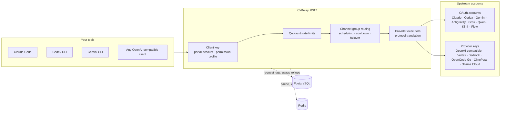

<p align="center">
  
  
  
  
  
</p>

<h1 align="center">CliRelay</h1>

<p align="center">
  <strong>A self-hosted gateway that puts your AI coding subscriptions and API keys behind one endpoint — with a multi-tenant control panel to run it.</strong>
</p>

<p align="center">
  Route Claude Code, Codex, Gemini CLI and any OpenAI-compatible client through the accounts you already pay for.<br/>
  See every request, cap every key, and fail over automatically when an account runs dry.
</p>

<p align="center">
  English | <a href="README_CN.md">中文</a>
</p>

<p align="center">
  <a href="https://help.router-for.me/">Docs</a> ·
  <a href="https://github.com/kittors/codeProxy">Control panel</a> ·
  <a href="https://github.com/kittors/CliRelay/releases">Releases</a> ·
  <a href="https://github.com/kittors/CliRelay/issues">Report a bug</a>
</p>

<p align="center">
  
</p>

---

## Contents

- [What is CliRelay?](#what-is-clirelay)
- [Highlights](#highlights)
- [How a request flows](#how-a-request-flows)
- [A tour of the control panel](#a-tour-of-the-control-panel)
- [Supported providers](#supported-providers)
- [Quick start](#quick-start)
- [Connect your tools](#connect-your-tools)
- [Configuration essentials](#configuration-essentials)
- [Deployment options](#deployment-options)
- [Architecture](#architecture)
- [Documentation](#documentation)
- [Contributing](#contributing)
- [License and acknowledgements](#license-and-acknowledgements)

## What is CliRelay?

> **A heavily extended fork of [CLIProxyAPI](https://github.com/router-for-me/CLIProxyAPI)**, rebuilt around a production management layer, a web control panel and day-2 operations.

CliRelay turns AI CLI subscriptions, OAuth credentials, provider API keys and OpenAI-compatible upstreams into **one managed API layer**. Clients talk to a single endpoint using the OpenAI, Anthropic or Gemini protocol; CliRelay authenticates them with its own client keys, picks a healthy upstream account, translates the request when needed, and records what happened.

It is built to be **run by a team**. Tenants keep their accounts, keys and data apart; users get roles with fine-grained permissions; every security-sensitive change lands in an audit log; and portal accounts let end users hold several API keys and check their own usage without asking an admin.

PostgreSQL 15+ is the source of truth for runtime data. Redis 7+ holds caches, locks, rate limits, queues and other rebuildable state.

## Highlights

| | |
| :-- | :-- |
| 🔌 **One endpoint, every provider** | Claude, Codex, Gemini CLI, Antigravity, Vertex, Bedrock, xAI/Grok, Qwen, Kimi, iFlow, OpenCode Go, ClinePass, Ollama Cloud, Command Code and any OpenAI-compatible upstream behind `http://your-host:8317`, speaking OpenAI Chat / Responses, Anthropic Messages and Gemini. |
| 🧭 **Routing that survives bad days** | Channel groups and custom paths decide where traffic may go; round-robin, fill-first and session-sticky scheduling spread it; cooldowns and automatic failover move it off exhausted or failing accounts. |
| 📈 **See everything** | A monitor center with a health score, per-minute live traffic, P50–P99 latency and time to first token, failure analysis and a portal user → model → channel traffic flow, plus a searchable log of every request with tokens, latency and cost. |
| 💳 **Control spend** | Client keys grouped under portal accounts, reusable permission profiles, daily / period / lifetime quotas, RPM and TPM limits, per-model pricing and one-click period resets. |
| 🏛️ **Built for teams** | Tenants, users, roles, `resource.action` permissions, a curated menu per tenant and an audit trail for security-sensitive changes. |
| 🖥️ **Operate from the browser** | A `/manage` control panel to add accounts with guided sign-in or credential import, edit config visually, manage models and pricing, and check for updates — in English, Simplified Chinese and Russian. |

## How a request flows


```mermaid
flowchart LR
    subgraph clients["Your tools"]
        cc["Claude Code"]
        cx["Codex CLI"]
        gc["Gemini CLI"]
        oa["Any OpenAI-compatible client"]
    end

    subgraph relay["CliRelay :8317"]
        auth["Client key<br/>portal account · permission profile"]
        quota["Quotas & rate limits"]
        route["Channel group routing<br/>scheduling · cooldown · failover"]
        exec["Provider executors<br/>protocol translation"]
        auth --> quota --> route --> exec
    end

    subgraph upstreams["Upstream accounts"]
        oauth["OAuth accounts<br/>Claude · Codex · Gemini · Antigravity · Grok · Qwen · Kimi · iFlow"]
        keys["Provider keys<br/>OpenAI-compatible · Vertex · Bedrock · OpenCode Go · ClinePass · Ollama Cloud"]
    end

    clients --> auth
    exec --> oauth
    exec --> keys
    relay -. "request logs, usage rollups" .-> pg[("PostgreSQL")]
    relay -. "cache, locks, limits" .-> rd[("Redis")]
```

1. **Authenticate.** A client key resolves to its portal account and permission profile, which decide the allowed channel groups, models and quotas.
2. **Admit.** Daily, period and lifetime spending, request quotas, RPM, TPM and concurrency are checked before anything reaches an upstream — for HTTP and for Responses WebSocket turns alike.
3. **Route.** The request goes to a healthy channel (an AI account or a provider key) inside the allowed groups, following the scheduling strategy; failures cool the channel down and fail over to the next one.
4. **Translate and record.** The executor speaks the upstream's protocol, streams the answer back, and writes a request log row and usage rollups that power the dashboards.

## A tour of the control panel

The control panel ([kittors/codeProxy](https://github.com/kittors/codeProxy)) is served by CliRelay at `/manage`. The screenshots below follow its own navigation and were taken from a live deployment; names, keys, addresses and accounts are replaced with sample values.

### Observability

| Monitor center — traffic and reliability over time | Monitor center — rankings, traffic flow and active hours |
| :-- | :-- |
|  |  |

| Dashboard | Request logs |
| :-- | :-- |
|  |  |

- **Monitor center** answers four questions at a glance: is it healthy, is it slow, what is failing, and where is traffic going.
  - The health score combines success rate, the share of traffic on failing channels and P95 latency against the previous period, and explains each check.
  - Six tiles cover requests, success rate, P95 latency, time to first token, tokens with cache hit rate, and cost — each with a period-over-period change and a sparkline.
  - Below them: a trend view, the latency distribution (P50 / P90 / P95 / P99), failures by channel, model or portal user, model / channel / user rankings, a traffic-flow diagram and a weekday × hour heatmap. Click any row to filter the whole page.
- **Dashboard** summarises requests, success rate, tokens, cost, failures and cache ratio for today, 7 or 30 days, next to a live system monitor (CPU, memory, disk, database and log storage).
- **Request logs** list every call with its channel, portal user and key, cache / input / output tokens, latency and cost. Filter by user, model, channel and status, and open the request and response bodies when body storage is enabled.

<details>
<summary><b>More monitor-center views</b></summary>

| Model performance, channel health and portal users | Dark theme |
| :-- | :-- |
|  |  |

</details>

### Access and credentials

| Add an AI account | Import credentials you already hold |
| :-- | :-- |
|  |  |

| AI accounts | AI providers |
| :-- | :-- |
|  |  |

| Portal accounts | Portal account permissions |
| :-- | :-- |
|  |  |

| Content moderation | CC Switch config |
| :-- | :-- |
|  |  |

- **Add AI account** groups every way in by what you will do — sign in with a browser, enter a device code, or import a credential — and walks through the steps that provider actually has, including which address to copy back and why the landing page does not load.
- **Credential import** turns a held credential (Claude session key, Codex or Antigravity refresh token, Grok SSO cookie) into an account. It explains where to find each one and what handing it over means, accepts many at once, and retries failed rows on their own.
- **AI accounts** show each OAuth account with its plan, quota windows, success rate and subscription expiry; **AI providers** hold API-key upstreams with base URL, headers, proxy binding and per-key model lists.
- **Portal accounts** own one or more client keys and share a quota; **permission profiles** bundle channel groups, models, limits and an optional system prompt so a new user is set up in one pick.
- **Content moderation** profiles can be tested against sample text and bound to accounts, keys or a provider default; **CC Switch config** builds one-click import presets for Claude Code and Codex.

### Models and routing

| Model plaza | Model catalog |
| :-- | :-- |
|  |  |

| Channel groups | Outbound proxies |
| :-- | :-- |
|  |  |

- **Model plaza** shows every model the current tenant can reach, with capabilities, the channels that serve it and its price per million tokens.
- **Model catalog** is where models, owners, capabilities and pricing are maintained, with an optional OpenRouter sync and a built-in model test.
- **Channel groups** decide which channels a key may use and how traffic is spread inside the group; groups can follow new upstream models automatically.
- **Outbound proxies** are defined once and bound to the accounts or provider keys that need a fixed egress IP.

### Organization

| Tenants | Users |
| :-- | :-- |
|  |  |

| Roles and permissions | Audit logs |
| :-- | :-- |
|  |  |

- **Tenants** carry their own accounts, keys, routing and data, with a lease period; administrators switch the effective tenant from the header.
- **Roles** grant `resource.action` permissions such as `providers.test` or `models.write`, which decide the pages, buttons and API calls each user gets.
- **Audit logs** record who changed what, from where, and whether it succeeded.

### System

| Visual config editor | System info |
| :-- | :-- |
|  |  |

| Menu management | Sign-in |
| :-- | :-- |
|  |  |

- **Config** edits the running configuration through grouped forms with inline validation, or as YAML in the source editor; a recommended low-resource profile tunes small hosts in one click.
- **System info** shows the API and management endpoints, backend and panel versions, and checks for updates.
- **Menu management** curates which entries a tenant sees and which permission each requires.

## Supported providers

| Provider / channel | How it connects | Notes |
| :-- | :-- | :-- |
| Anthropic Claude | OAuth (browser or code page), session-key import, API key | Claude Code and Claude-compatible clients; Messages and Responses entrypoints |
| OpenAI Codex | OAuth, refresh-token import, API key | Responses over HTTP and WebSocket, image generation bridge |
| Google Gemini | OAuth (Gemini CLI), API key | Gemini CLI and AI Studio style flows |
| Antigravity | OAuth, refresh-token import | Gemini and Claude model families, quota warmup |
| Vertex AI | Service-account JSON, API key | Custom base URL, headers, aliases and exclusions |
| AWS Bedrock | API key or SigV4 | Region-aware Bedrock Runtime with Claude model mappings |
| xAI / Grok | OAuth, SSO-cookie import | Grok CLI identity and quota metadata |
| Qwen | Device code | Qwen Code style sign-in |
| Kimi | Device code | Kimi CLI identity headers |
| iFlow | OAuth, cookie | iFlow and related model families |
| OpenCode Go | API key | Usage windows read with the same key; vision fallback model |
| ClinePass | API key | OpenAI-compatible routing with model-access control |
| Ollama Cloud | API key | OpenAI-compatible routing with model-access control |
| Command Code | API key | Plan usage windows and model access |
| OpenAI-compatible upstreams | API key | OpenRouter and any service that speaks Chat Completions |
| Amp | Upstream key and model mappings | Amp CLI and IDE integration |

## Quick start

Docker Compose is the recommended installation. It starts CliRelay, PostgreSQL 15, Redis 7 and the updater sidecar.

```bash
git clone https://github.com/kittors/CliRelay.git
cd CliRelay
# Linux bind mounts need write access for the non-root container user:
# sudo chown -R 10001:10001 auths logs data
docker compose up -d
```

On the first start, the `clirelay-init` service creates `.env` and `config.yaml` if they are missing and generates the secrets it needs (`CLIRELAY_ADMIN_PASSWORD`, `CLIRELAY_POSTGRES_PASSWORD`, `CLIRELAY_UPDATER_TOKEN`). Existing non-empty values are kept.

| What | Where |
| :-- | :-- |
| API endpoint | `http://localhost:8317` |
| Control panel | `http://localhost:8317/manage` — sign in as `admin` with `CLIRELAY_ADMIN_PASSWORD` from `.env` |
| Logs | `docker compose logs -f cli-proxy-api` |
| Restart / stop | `docker compose restart cli-proxy-api` / `docker compose down` |
| Terminal UI | `docker compose exec cli-proxy-api ./cli-proxy-api -tui` |

Then, in the control panel:

1. **Add an upstream** — *AI Accounts → Add AI account* to sign in with a subscription or import a credential, or *AI Providers* for an API key.
2. **Create a client key** — *Portal Accounts → Create user*; each portal account holds one or more keys. A fresh install ships with no client key and rejects client requests until you create one; the `your-api-key-*` values in `config.example.yaml` are placeholders that are always rejected.
3. **Point your tools at CliRelay** — see below.

> [!NOTE]
> The container runs as `10001:10001`; `config.yaml` must be readable by it, and writable if you want to save config from the panel. If a Synology/DSM shared-folder ACL blocks the entrypoint's `chown`, fix ownership on the host and restart `cli-proxy-api`. If you pre-set `CLIRELAY_ADMIN_PASSWORD`, use at least 12 characters with an upper-case letter, a lower-case letter and a symbol; a weaker value is replaced on the next start.

## Connect your tools

Use a client key created in the panel wherever a tool expects an API key.

**Claude Code**

```bash
export ANTHROPIC_BASE_URL=http://localhost:8317
export ANTHROPIC_AUTH_TOKEN=sk-your-client-key
claude
```

**Codex CLI** (`~/.codex/config.toml`)

```toml
model_provider = "clirelay"

[model_providers.clirelay]
name = "openai"
base_url = "http://localhost:8317/v1"
requires_openai_auth = true
```

**Any OpenAI-compatible client**

```bash
curl http://localhost:8317/v1/chat/completions \
  -H "Authorization: Bearer sk-your-client-key" \
  -H "Content-Type: application/json" \
  -d '{"model": "gpt-5.5", "messages": [{"role": "user", "content": "Hello"}]}'
```

> [!TIP]
> *CC Switch Config* in the panel builds a one-click import link for Claude Code and Codex, with the model mapping and channel group already filled in.

Full client guides: [help.router-for.me](https://help.router-for.me/).

## Configuration essentials

Everything below can be changed in the panel's **Config** page or in `config.yaml`.

| Setting | What it controls |
| :-- | :-- |
| `port`, `host` | Where the API and panel listen (default `8317`, all interfaces). |
| `remote-management` | Whether the management API accepts non-local callers, whether `/manage` is served, and which repository the panel updates from (`panel-github-repository`, default `kittors/codeProxy`). |
| `routing.strategy` | Default scheduling inside a group: `round-robin`, `fill-first` or `session-sticky`. |
| `request-retry`, `max-retry-interval`, `quota-exceeded` | How many times a failed request is retried and what happens when an account's quota runs out. |
| `proxy-url`, proxy pool | Global and per-account outbound proxies. |
| `request-log-storage` | Whether full request / response bodies are kept, for how long and up to what size. Off by default; metadata and request details are always recorded. |
| `auto-update` | Update checks and the channel they follow (`main` by default, `dev` for preview builds). |
| `cors-allow-origins` | Browser and extension origins allowed to call the API. |

```yaml
# Keep full bodies for 7 days, capped at 2 GB
request-log-storage:
  store-content: true
  content-retention-days: 7
  max-total-size-mb: 2048

# Follow dev builds, or turn update checks off
auto-update:
  enabled: true
  channel: dev
```

Config and credential storage can also live in PostgreSQL, Git or an S3-compatible object store instead of local files, selected through environment-based bootstrap settings.

## Deployment options

| Setup | When to use it | Guide |
| :-- | :-- | :-- |
| Single node, Docker Compose | Personal use, small teams, NAS | [Quick start](#quick-start) · [Production checklist](docs/production-checklist.md) |
| Behind nginx or another reverse proxy | Public HTTPS, custom domain | [Reverse proxy (Chinese)](docs/reverse-proxy_CN.md) |
| Several nodes on one shared PostgreSQL | Spreading traffic, automatic failover, rolling deploys | [Multi-instance deployment](docs/multi-instance-deployment.md) · [Node bootstrap (Chinese)](docs/multi-instance-node-bootstrap_CN.md) |

Online updates run through the updater sidecar: the panel shows the target version, each stage as it happens, and the result, and reconnects on its own if the API restarts during the update.

## Architecture

```text
CliRelay/
├── cmd/server/               # Binary entry point and CLI modes
├── internal/api/             # HTTP server, management routes, middleware
├── internal/auth/            # Provider OAuth, cookie and device-code flows
├── internal/runtime/         # Executors per provider, scheduling, cooldown
├── internal/translator/      # OpenAI ⇄ Anthropic ⇄ Gemini ⇄ Responses translation
├── internal/identity/        # Tenants, users, roles, permissions, menus, audit logs
├── internal/usage/           # Request logs, rollups, monitor endpoints, retention
├── internal/config/          # Config parsing, defaults, migrations
├── internal/store/           # Local, Git, PostgreSQL and object-store persistence
├── internal/managementasset/ # /manage panel hosting and asset sync
├── internal/tui/             # Terminal management UI
├── sdk/                      # Embeddable Go SDK, handlers and executors
├── deploy/                   # Cluster building blocks and deploy scripts
└── docker-compose.yml        # Default container deployment
```

| Layer | Technology |
| :-- | :-- |
| Runtime | Go 1.26, Gin, Docker Compose |
| Data | PostgreSQL 15+ via Ent, Redis 7+ for rebuildable state |
| Proxy core | OpenAI Chat Completions and Responses, Anthropic Messages, Gemini; SSE and WebSocket |
| Operations | `/manage` web panel, Bubble Tea terminal UI, updater sidecar |

## Documentation

| Document | Description |
| :-- | :-- |
| [Getting started](https://help.router-for.me/) | Installation and client setup guides |
| [Management API](https://help.router-for.me/management/api) | REST reference for the management endpoints |
| [Amp CLI](https://help.router-for.me/agent-client/amp-cli.html) | Using Amp CLI and IDE extensions with CliRelay |
| [Production checklist](docs/production-checklist.md) | Shared gateways and NAS installations |
| [PostgreSQL / Redis runtime](docs/postgres-redis-migration.md) | Runtime data stack setup and validation |
| [Multi-instance deployment](docs/multi-instance-deployment.md) | Several nodes on one PostgreSQL: failover, switchover, rolling deploys |
| [SDK usage](docs/sdk-usage.md) · [advanced](docs/sdk-advanced.md) · [access](docs/sdk-access.md) · [watcher](docs/sdk-watcher.md) | Embedding the proxy in Go applications |

## Contributing

```bash
git clone https://github.com/kittors/CliRelay.git
cd CliRelay
git fetch origin
git switch -c feature/your-change origin/dev
# make your change, then
git push origin feature/your-change   # and open a pull request against dev
```

Please target pull requests at `dev`, not `main`; `main` is updated by releases. See [CONTRIBUTING.md](CONTRIBUTING.md) for the branch and merge workflow.

## License and acknowledgements

CliRelay is released under the [MIT License](LICENSE).

It stands on the core proxy logic of **[router-for-me/CLIProxyAPI](https://github.com/router-for-me/CLIProxyAPI)**. Our thanks to the original project and all its contributors — their foundation made it possible to build the management layer, request logging, quota control and the control panel on top.
