<p align="center">
  
  
  
  
  
</p>

<h1 align="center">CliRelay</h1>

<p align="center">
  <strong>私有部署的 AI 网关：把你的 AI 编程订阅和 API Key 收进同一个入口，并配一套多租户管理面板来运营它。</strong>
</p>

<p align="center">
  让 Claude Code、Codex、Gemini CLI 以及任何 OpenAI 兼容客户端，都走你已经付费的账号。<br/>
  每个请求看得见，每把 Key 管得住，账号额度用完时自动切走。
</p>

<p align="center">
  <a href="README.md">English</a> | 中文
</p>

<p align="center">
  <a href="https://help.router-for.me/">文档</a> ·
  <a href="https://github.com/kittors/codeProxy">管理面板</a> ·
  <a href="https://github.com/kittors/CliRelay/releases">版本发布</a> ·
  <a href="https://github.com/kittors/CliRelay/issues">反馈问题</a>
</p>

<p align="center">
  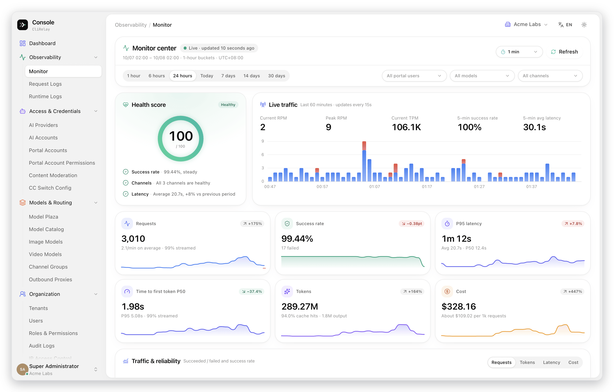
</p>

---

## 目录

- [CliRelay 是什么](#clirelay-是什么)
- [核心能力](#核心能力)
- [一个请求怎么走](#一个请求怎么走)
- [管理面板导览](#管理面板导览)
- [支持的上游](#支持的上游)
- [快速开始](#快速开始)
- [接入你的工具](#接入你的工具)
- [关键配置](#关键配置)
- [部署方式](#部署方式)
- [项目结构](#项目结构)
- [文档](#文档)
- [参与贡献](#参与贡献)
- [许可证与致谢](#许可证与致谢)

## CliRelay 是什么

> **基于 [CLIProxyAPI](https://github.com/router-for-me/CLIProxyAPI) 深度扩展的分支**，围绕生产级管理层、Web 管理面板和日常运维重新构建。

CliRelay 把 AI CLI 订阅、OAuth 凭据、各家 API Key 和 OpenAI 兼容上游，统一成**一个受管的 API 层**。客户端用 OpenAI、Anthropic 或 Gemini 协议访问同一个入口；CliRelay 用自己签发的客户端 Key 做鉴权，挑一个健康的上游账号，必要时转换协议，并把这次请求完整记录下来。

它是为**团队运营**设计的：租户之间账号、Key 和数据互相隔离；用户按角色获得细粒度权限；所有安全敏感的变更都进审计日志；门户账号让终端用户名下挂多把 API Key，自己查看用量，不必找管理员。

运行时数据以 PostgreSQL 15+ 为唯一可信来源；Redis 7+ 负责缓存、锁、限流、队列等可重建的状态。

## 核心能力

| | |
| :-- | :-- |
| 🔌 **一个入口，接所有上游** | Claude、Codex、Gemini CLI、Antigravity、Vertex、Bedrock、xAI/Grok、Qwen、Kimi、iFlow、OpenCode Go、ClinePass、Ollama Cloud、Command Code 以及任意 OpenAI 兼容上游，统一在 `http://你的主机:8317` 后面，支持 OpenAI Chat / Responses、Anthropic Messages 与 Gemini 协议。 |
| 🧭 **扛得住波动的调度** | 渠道分组与自定义路径决定流量能去哪；轮询、优先填满、会话粘性三种策略负责分配；冷却与自动故障转移把流量从额度耗尽或出错的账号上移开。 |
| 📈 **全程可观测** | 监控中心提供健康评分、逐分钟实时流量、P50–P99 延迟与首 token 时间、失败分析，以及「门户用户 → 模型 → 渠道」流量流向；请求日志逐条记录 token、耗时与费用，可检索。 |
| 💳 **花费可控** | 客户端 Key 归属到门户账号，配合可复用的权限模板、日 / 周期 / 累计额度、RPM 与 TPM 限制、按模型定价，以及一键按周期重置。 |
| 🏛️ **为团队而建** | 租户、用户、角色、`resource.action` 细粒度权限、按租户定制的菜单，以及安全敏感变更的审计记录。 |
| 🖥️ **在浏览器里运维** | `/manage` 管理面板：引导式登录或导入凭据来添加账号、可视化编辑配置、维护模型与定价、检查更新；界面支持中文、英文和俄语。 |

## 一个请求怎么走

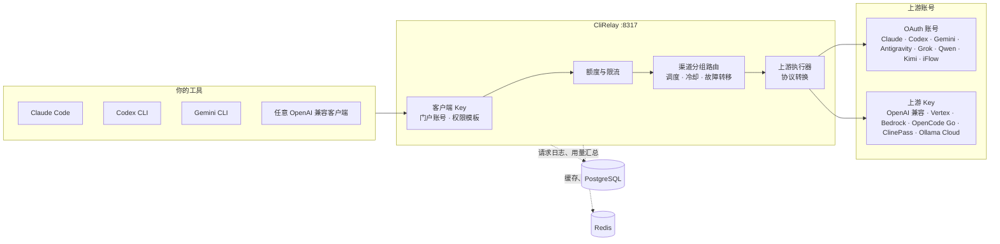
```mermaid
flowchart LR
    subgraph clients["你的工具"]
        cc["Claude Code"]
        cx["Codex CLI"]
        gc["Gemini CLI"]
        oa["任意 OpenAI 兼容客户端"]
    end

    subgraph relay["CliRelay :8317"]
        auth["客户端 Key<br/>门户账号 · 权限模板"]
        quota["额度与限流"]
        route["渠道分组路由<br/>调度 · 冷却 · 故障转移"]
        exec["上游执行器<br/>协议转换"]
        auth --> quota --> route --> exec
    end

    subgraph upstreams["上游账号"]
        oauth["OAuth 账号<br/>Claude · Codex · Gemini · Antigravity · Grok · Qwen · Kimi · iFlow"]
        keys["上游 Key<br/>OpenAI 兼容 · Vertex · Bedrock · OpenCode Go · ClinePass · Ollama Cloud"]
    end

    clients --> auth
    exec --> oauth
    exec --> keys
    relay -. "请求日志、用量汇总" .-> pg[("PostgreSQL")]
    relay -. "缓存、锁、限流" .-> rd[("Redis")]
```

1. **鉴权**：客户端 Key 对应到门户账号和权限模板，由它们决定可用的渠道分组、模型和额度。
2. **准入**：请求到达上游之前，先检查日 / 周期 / 累计花费、请求额度、RPM、TPM 和并发；HTTP 请求和 Responses WebSocket 的每一轮都一样检查。
3. **路由**：在允许的分组里按调度策略选一个健康的渠道（AI 账号或上游 Key）；出错的渠道进入冷却，请求转给下一个。
4. **转换与记录**：执行器按上游协议发出请求并流式返回结果，同时写入请求日志和用量汇总，供各类看板使用。

## 管理面板导览

管理面板（[kittors/codeProxy](https://github.com/kittors/codeProxy)）由 CliRelay 在 `/manage` 提供。下面的截图按面板自己的导航分组，取自真实部署；其中的名称、Key、地址和账号均已替换为示例值。

### 运行观测

| 监控中心：流量与可靠性趋势 | 监控中心：排行、流量流向与活跃时段 |
| :-- | :-- |
| 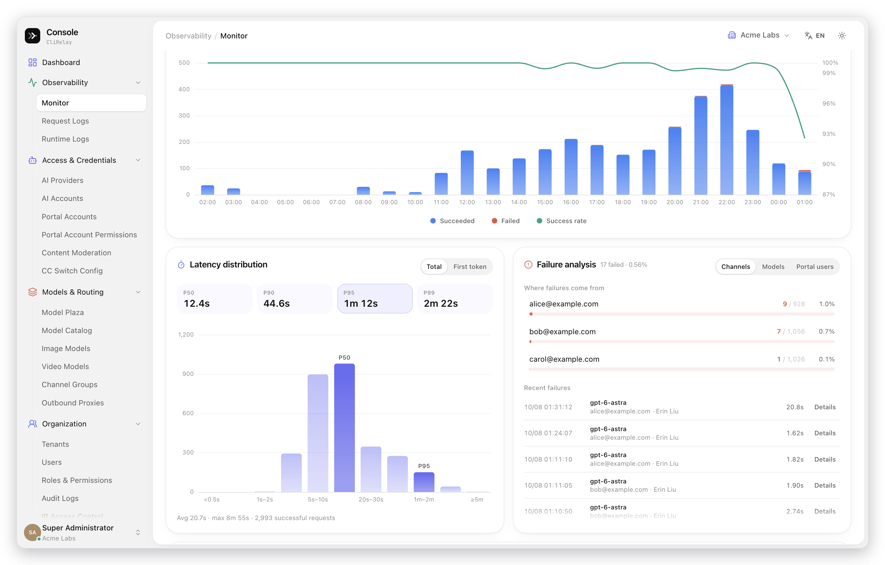 |  |

| 仪表盘 | 请求日志 |
| :-- | :-- |
| 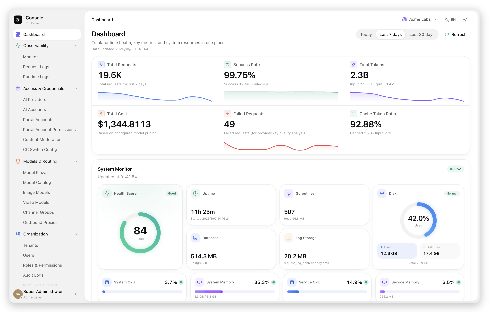 | 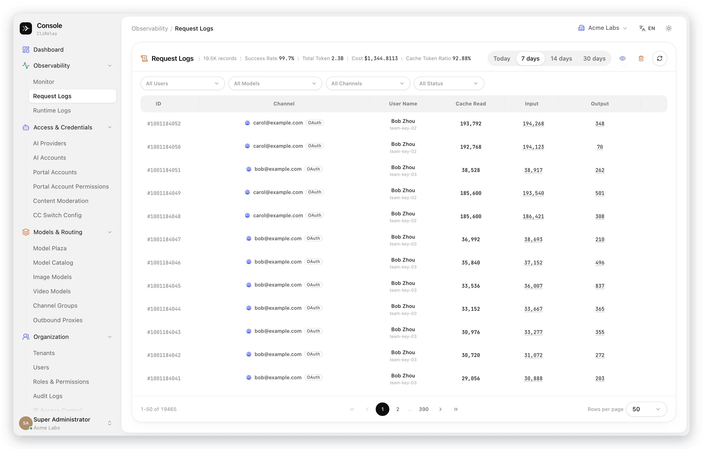 |

- **监控中心**一眼回答四个问题：健不健康、慢不慢、哪里在失败、流量去了哪里。
  - 健康评分综合成功率、失败渠道承接的流量占比、P95 延迟相对上一周期的变化，并逐项给出诊断。
  - 六张指标卡覆盖请求数、成功率、P95 延迟、首 token 时间、token（含缓存命中率）和费用，每张都带环比和迷你趋势。
  - 再往下是趋势图、延迟分布（P50 / P90 / P95 / P99）、按渠道 / 模型 / 门户用户的失败分析、模型 / 渠道 / 用户排行、流量流向图和星期 × 小时热力图。点击任意一行即可筛选整页。
- **仪表盘**汇总今天、近 7 天或 30 天的请求、成功率、token、费用、失败数和缓存占比，旁边是实时系统监控（CPU、内存、磁盘、数据库与日志存储）。
- **请求日志**逐条列出每次调用的渠道、门户用户与 Key、缓存 / 输入 / 输出 token、耗时和费用；可按用户、模型、渠道和状态筛选，开启请求体存储后还能查看完整的请求与响应内容。

<details>
<summary><b>更多监控中心视图</b></summary>

| 模型表现、渠道健康与门户用户 | 深色主题 |
| :-- | :-- |
| 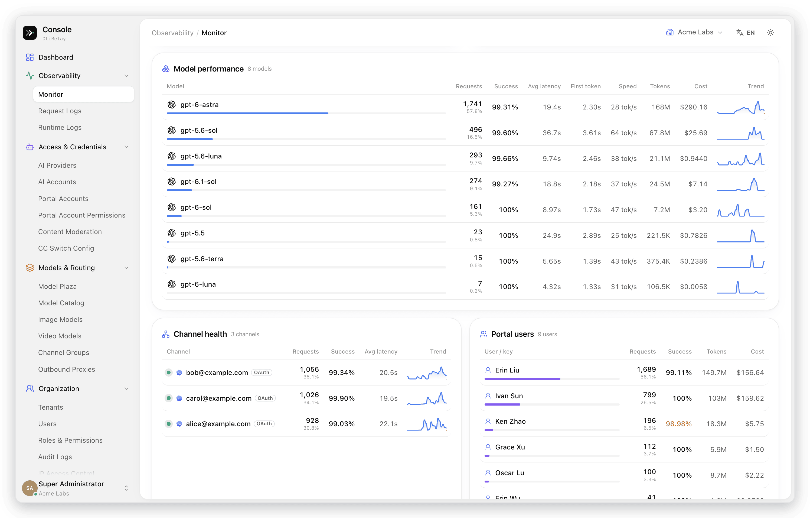 | 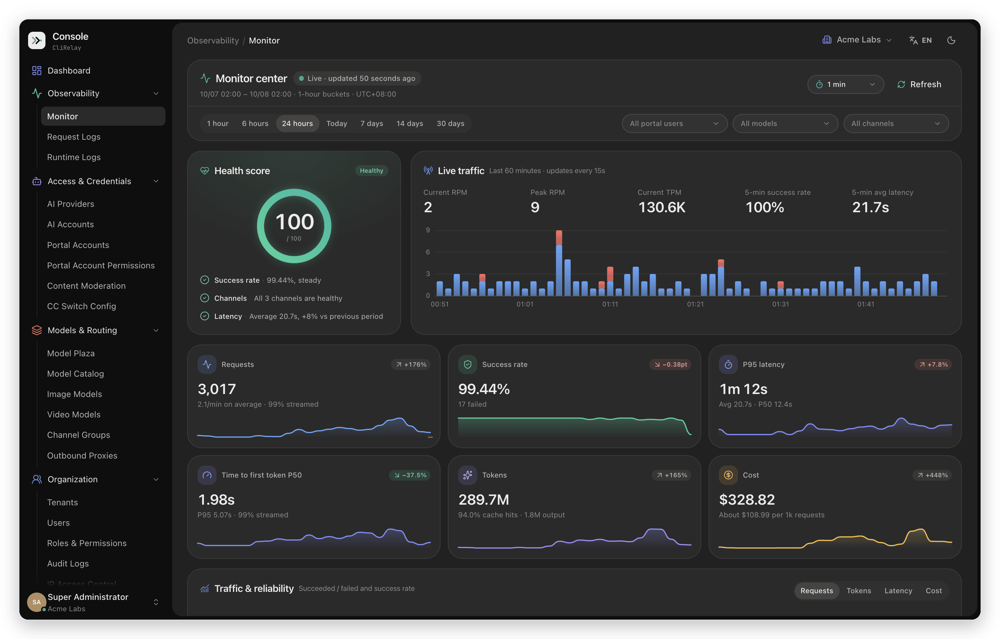 |

</details>

### 接入与凭证

| 添加 AI 账号 | 导入已有凭据 |
| :-- | :-- |
|  |  |

| AI 账号 | AI 供应商 |
| :-- | :-- |
| 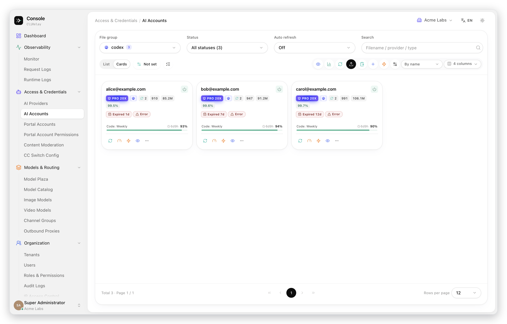 |  |

| 门户账号 | 门户账号权限 |
| :-- | :-- |
|  | 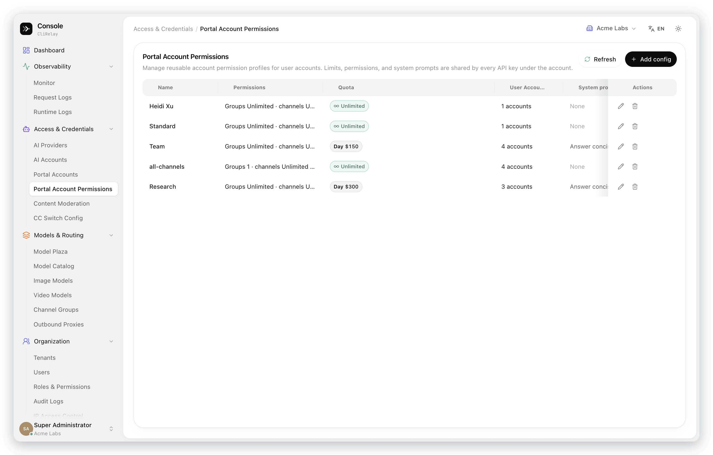 |

| 内容审核 | CC Switch 配置 |
| :-- | :-- |
| 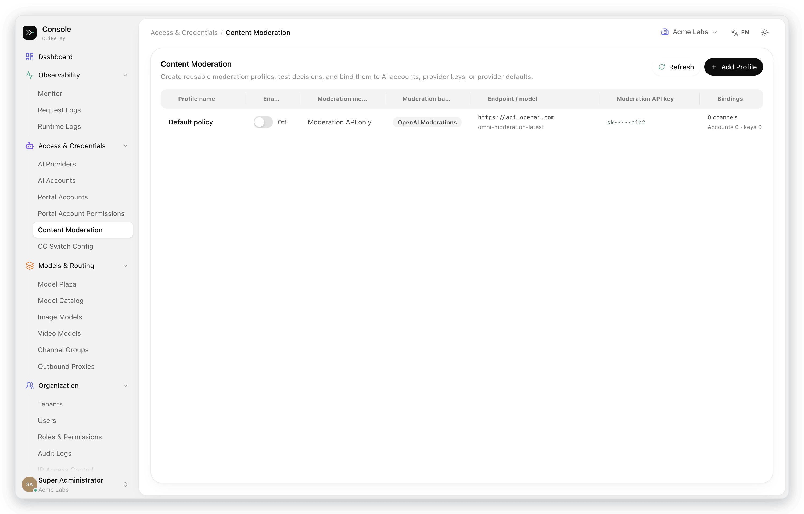 | 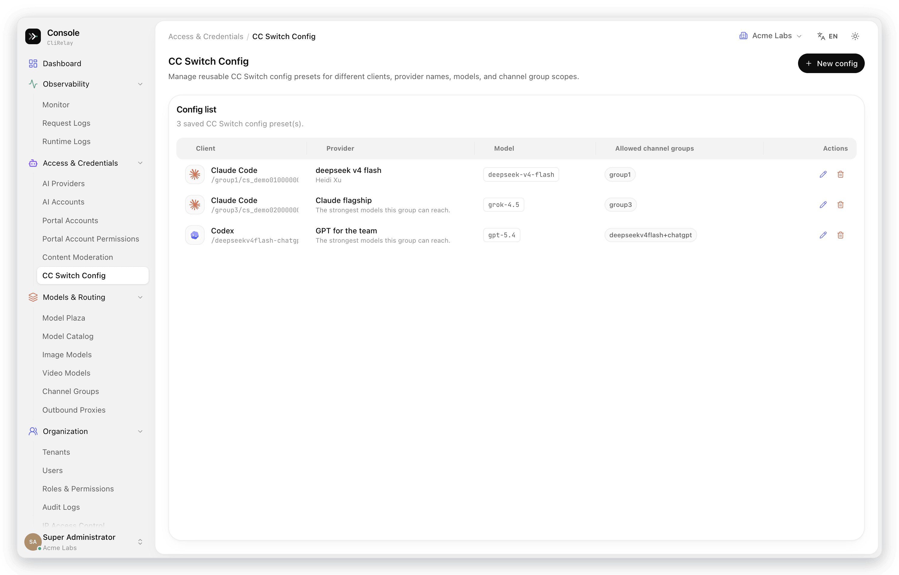 |

- **添加 AI 账号**按你要做的事给出入口——浏览器登录、输入设备码、导入凭据——并针对每个提供商给出它实际的步骤，包括该把哪一段地址复制回来、为什么跳转后的页面打不开。
- **凭据导入**把手上已有的凭据（Claude 会话密钥、Codex 或 Antigravity 的 refresh token、Grok SSO Cookie）变成账号；会说明每种凭据在哪里获取、交出去意味着什么，支持一次粘贴多条，失败的单条可以单独重试。
- **AI 账号**展示每个 OAuth 账号的套餐、额度窗口、成功率和订阅到期；**AI 供应商**管理基于 API Key 的上游，包括 Base URL、请求头、代理绑定和每把 Key 的模型列表。
- **门户账号**名下可以有一把或多把客户端 Key，共享同一份额度；**权限模板**把渠道分组、模型、限额和可选的系统提示词打包在一起，新用户选一个模板即可配好。
- **内容审核**配置可以先用样例文本测试，再绑定到账号、Key 或上游默认；**CC Switch 配置**为 Claude Code 和 Codex 生成一键导入预设。

### 模型与调度

| 模型广场 | 模型目录 |
| :-- | :-- |
| 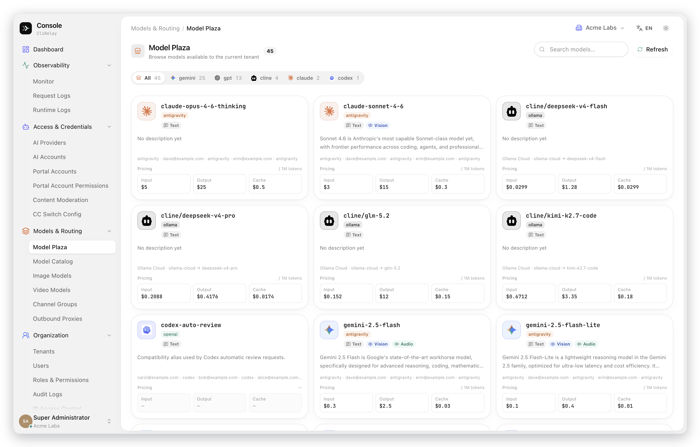 | 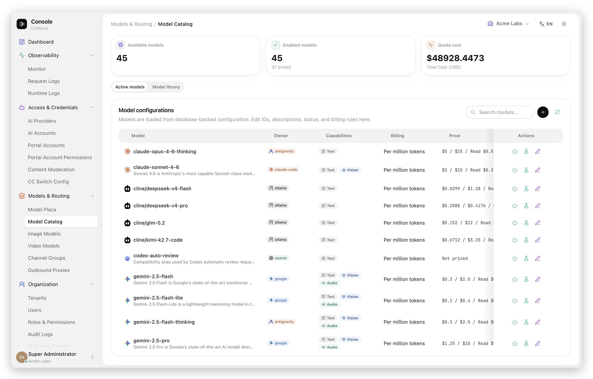 |

| 渠道分组 | 出站代理 |
| :-- | :-- |
|  | 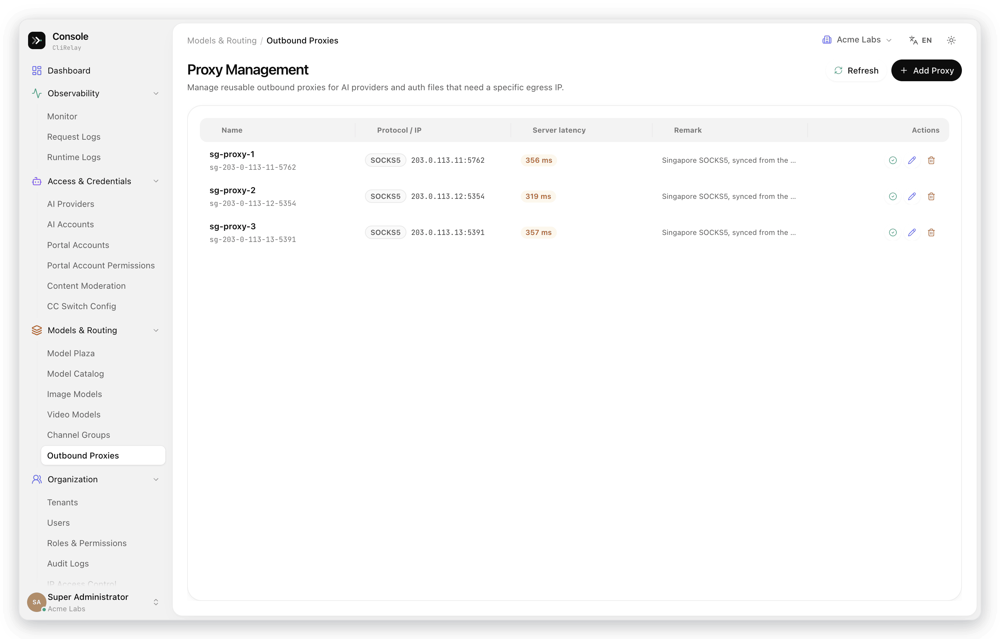 |

- **模型广场**列出当前租户能用的全部模型，附能力标签、提供它的渠道，以及每百万 token 的价格。
- **模型目录**维护模型、归属、能力与定价，可选 OpenRouter 同步，并内置模型测试。
- **渠道分组**决定一把 Key 能用哪些渠道、分组内流量怎么分配；分组可以自动跟随上游新增的模型。
- **出站代理**定义一次，绑定到需要固定出口 IP 的账号或上游 Key 上。

### 组织与权限

| 租户管理 | 用户管理 |
| :-- | :-- |
| 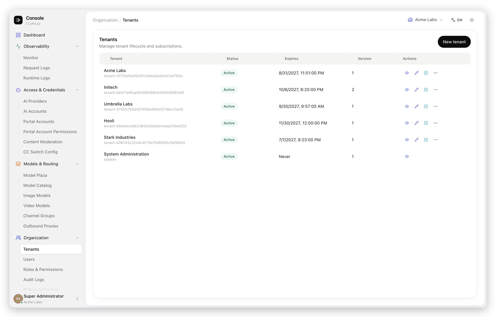 | 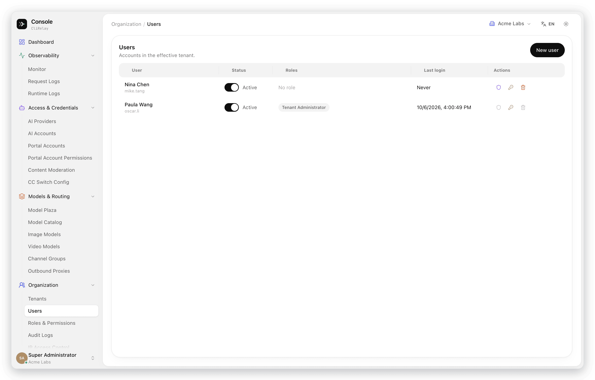 |

| 角色权限 | 审计日志 |
| :-- | :-- |
| 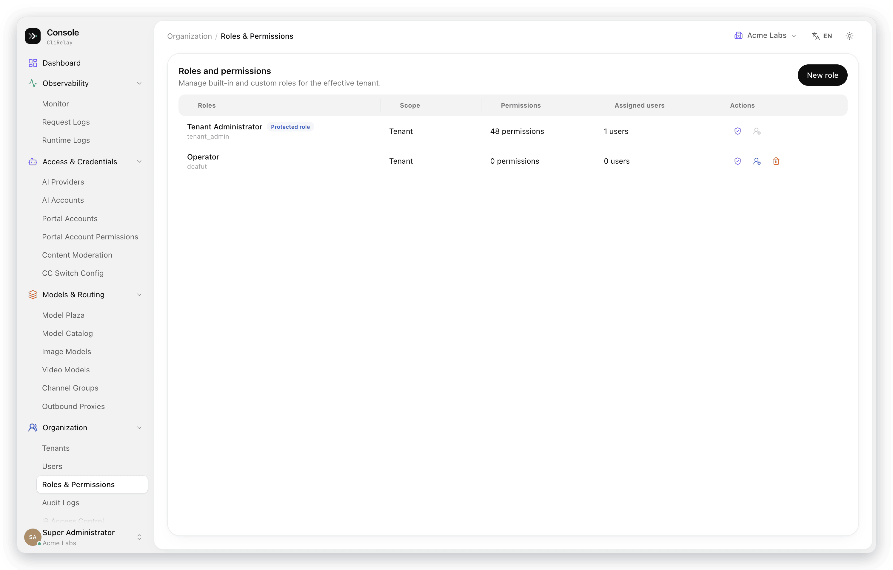 | 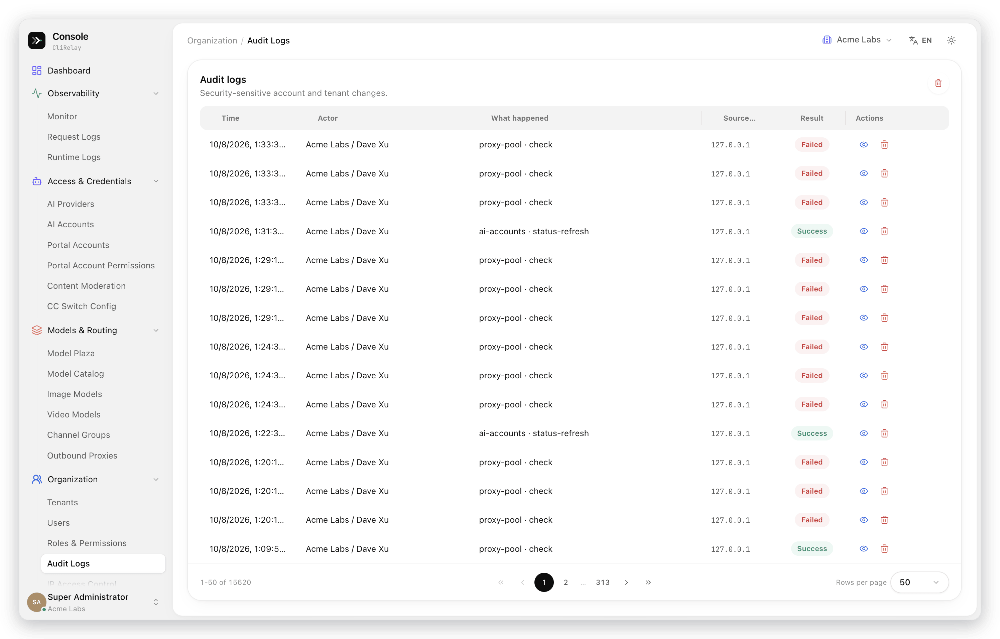 |

- **租户**各自拥有账号、Key、路由与数据，并有租期；管理员在页头切换当前生效的租户。
- **角色**授予 `providers.test`、`models.write` 这类 `resource.action` 权限，决定每个用户能看到哪些页面、按钮和接口。
- **审计日志**记录谁在什么地方改了什么、结果如何。

### 系统设置

| 可视化配置 | 系统信息 |
| :-- | :-- |
|  | 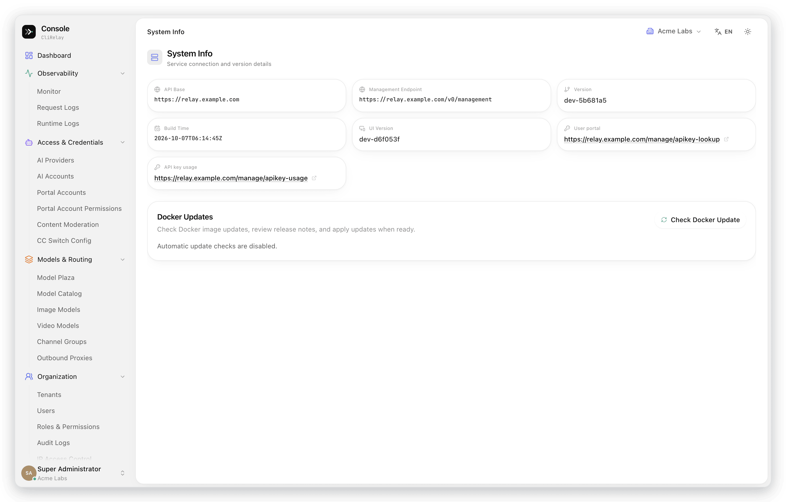 |

| 菜单管理 | 登录页 |
| :-- | :-- |
| 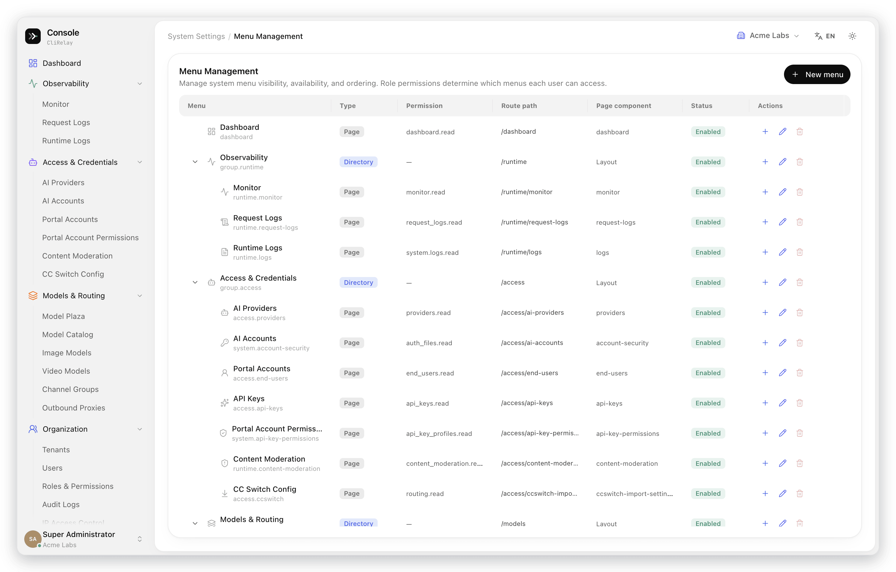 | 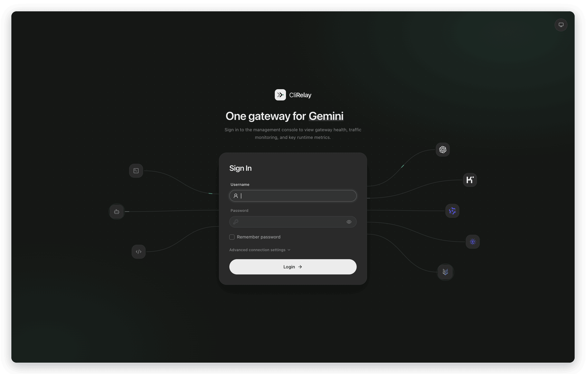 |

- **配置面板**用分组表单编辑运行中的配置，带即时校验；也可以切到源码编辑器直接改 YAML。低资源推荐配置一键调优小内存主机。
- **系统信息**展示 API 与管理接口地址、后端和面板版本，并可检查更新。
- **菜单管理**决定一个租户能看到哪些菜单项，以及每一项需要什么权限。

## 支持的上游

| 上游 / 渠道 | 接入方式 | 说明 |
| :-- | :-- | :-- |
| Anthropic Claude | OAuth（浏览器或授权码页）、会话密钥导入、API Key | Claude Code 与 Claude 兼容客户端；支持 Messages 与 Responses 入口 |
| OpenAI Codex | OAuth、refresh token 导入、API Key | 基于 HTTP 与 WebSocket 的 Responses，含生图桥接 |
| Google Gemini | OAuth（Gemini CLI）、API Key | Gemini CLI 与 AI Studio 方式 |
| Antigravity | OAuth、refresh token 导入 | Gemini 与 Claude 系列模型，额度预热 |
| Vertex AI | 服务账号 JSON、API Key | 自定义 Base URL、请求头、别名与排除 |
| AWS Bedrock | API Key 或 SigV4 | 按区域访问 Bedrock Runtime，含 Claude 模型映射 |
| xAI / Grok | OAuth、SSO Cookie 导入 | Grok CLI 身份与额度信息 |
| Qwen | 设备码 | Qwen Code 方式登录 |
| Kimi | 设备码 | Kimi CLI 身份请求头 |
| iFlow | OAuth、Cookie | iFlow 及相关模型系列 |
| OpenCode Go | API Key | 用同一把 Key 读取用量窗口；支持图片回退模型 |
| ClinePass | API Key | OpenAI 兼容路由，带模型访问控制 |
| Ollama Cloud | API Key | OpenAI 兼容路由，带模型访问控制 |
| Command Code | API Key | 套餐用量窗口与模型访问控制 |
| OpenAI 兼容上游 | API Key | OpenRouter 以及任何支持 Chat Completions 的服务 |
| Amp | 上游 Key 与模型映射 | Amp CLI 与 IDE 集成 |

## 快速开始

推荐用 Docker Compose 安装，它会同时启动 CliRelay、PostgreSQL 15、Redis 7 和更新器 sidecar。

```bash
git clone https://github.com/kittors/CliRelay.git
cd CliRelay
# Linux 绑定挂载时，需要让容器内的非 root 用户有写权限：
# sudo chown -R 10001:10001 auths logs data
docker compose up -d
```

首次启动时，`clirelay-init` 服务会在 `.env` 和 `config.yaml` 缺失时创建它们，并生成所需的密钥（`CLIRELAY_ADMIN_PASSWORD`、`CLIRELAY_POSTGRES_PASSWORD`、`CLIRELAY_UPDATER_TOKEN`），已有的非空值会保留。

| 项目 | 位置 |
| :-- | :-- |
| API 入口 | `http://localhost:8317` |
| 管理面板 | `http://localhost:8317/manage`——用户名 `admin`，密码是 `.env` 里的 `CLIRELAY_ADMIN_PASSWORD` |
| 日志 | `docker compose logs -f cli-proxy-api` |
| 重启 / 停止 | `docker compose restart cli-proxy-api` / `docker compose down` |
| 终端界面 | `docker compose exec cli-proxy-api ./cli-proxy-api -tui` |

然后在管理面板里：

1. **添加上游**：在「AI 账号 → 添加 AI 账号」用订阅登录或导入凭据，或在「AI 供应商」添加 API Key。
2. **创建客户端 Key**：在「门户账号 → 创建用户」，每个门户账号名下可以有一把或多把 Key。全新安装不带任何客户端 Key，创建之前所有客户端请求都会被拒绝；`config.example.yaml` 里的 `your-api-key-*` 只是占位符，永远不会被接受。
3. **把工具指向 CliRelay**：见下一节。

> [!NOTE]
> 容器以 `10001:10001` 运行，`config.yaml` 需要对它可读；如果要在面板里保存配置，还需要可写。如果群晖 DSM 共享文件夹的 ACL 让入口脚本的 `chown` 失败，请在宿主机上修正属主后重启 `cli-proxy-api`。如果你预先设置了 `CLIRELAY_ADMIN_PASSWORD`，请至少 12 位，包含大写字母、小写字母和符号；不符合要求的值会在下次启动时被替换。

## 接入你的工具

凡是工具要求填 API Key 的地方，都填在面板里创建的客户端 Key。

**Claude Code**

```bash
export ANTHROPIC_BASE_URL=http://localhost:8317
export ANTHROPIC_AUTH_TOKEN=sk-你的客户端Key
claude
```

**Codex CLI**（`~/.codex/config.toml`）

```toml
model_provider = "clirelay"

[model_providers.clirelay]
name = "openai"
base_url = "http://localhost:8317/v1"
requires_openai_auth = true
```

**任意 OpenAI 兼容客户端**

```bash
curl http://localhost:8317/v1/chat/completions \
  -H "Authorization: Bearer sk-你的客户端Key" \
  -H "Content-Type: application/json" \
  -d '{"model": "gpt-5.5", "messages": [{"role": "user", "content": "你好"}]}'
```

> [!TIP]
> 面板里的「CC Switch 配置」可以为 Claude Code 和 Codex 生成一键导入链接，模型映射和渠道分组都已填好。

完整的客户端接入指南：[help.router-for.me](https://help.router-for.me/)。

## 关键配置

下面这些都可以在面板的「配置面板」里修改，也可以直接改 `config.yaml`。

| 配置项 | 作用 |
| :-- | :-- |
| `port`、`host` | API 与面板监听的位置（默认 `8317`，所有网卡）。 |
| `remote-management` | 管理接口是否接受非本机调用、是否提供 `/manage`，以及面板从哪个仓库更新（`panel-github-repository`，默认 `kittors/codeProxy`）。 |
| `routing.strategy` | 分组内默认的调度策略：`round-robin`、`fill-first` 或 `session-sticky`。 |
| `request-retry`、`max-retry-interval`、`quota-exceeded` | 失败请求重试几次，以及账号额度用完时怎么处理。 |
| `proxy-url`、代理池 | 全局与按账号的出站代理。 |
| `request-log-storage` | 是否保存完整的请求 / 响应体、保存多久、最多多大。默认关闭；元数据和请求详情始终会记录。 |
| `auto-update` | 更新检查及其跟随的渠道（默认 `main`，预览版用 `dev`）。 |
| `cors-allow-origins` | 允许调用 API 的浏览器与扩展来源。 |

```yaml
# 完整请求体保留 7 天，总量不超过 2 GB
request-log-storage:
  store-content: true
  content-retention-days: 7
  max-total-size-mb: 2048

# 跟随 dev 预览版；或者把 enabled 设为 false 关闭更新检查
auto-update:
  enabled: true
  channel: dev
```

配置与凭据也可以不放本地文件，改存 PostgreSQL、Git 或 S3 兼容的对象存储，通过基于环境变量的启动配置选择。

## 部署方式

| 方式 | 适用场景 | 指南 |
| :-- | :-- | :-- |
| 单节点 Docker Compose | 个人使用、小团队、NAS | [快速开始](#快速开始) · [生产检查清单](docs/production-checklist_CN.md) |
| 放在 nginx 等反向代理后面 | 公网 HTTPS、自定义域名 | [反向代理](docs/reverse-proxy_CN.md) |
| 多节点共享一套 PostgreSQL | 分摊流量、自动故障转移、滚动发布 | [多实例部署](docs/multi-instance-deployment_CN.md) · [节点初始化](docs/multi-instance-node-bootstrap_CN.md) |

在线更新由更新器 sidecar 完成：面板会显示目标版本、实际进行到的每个阶段和最终结果；更新期间 API 重启时，面板会自动重连。

## 项目结构

```text
CliRelay/
├── cmd/server/               # 程序入口与命令行模式
├── internal/api/             # HTTP 服务、管理路由、中间件
├── internal/auth/            # 各上游的 OAuth、Cookie 与设备码登录
├── internal/runtime/         # 各上游执行器、调度、冷却
├── internal/translator/      # OpenAI ⇄ Anthropic ⇄ Gemini ⇄ Responses 协议转换
├── internal/identity/        # 租户、用户、角色、权限、菜单、审计日志
├── internal/usage/           # 请求日志、汇总、监控接口、数据保留
├── internal/config/          # 配置解析、默认值、迁移
├── internal/store/           # 本地、Git、PostgreSQL 与对象存储持久化
├── internal/managementasset/ # /manage 面板托管与资源同步
├── internal/tui/             # 终端管理界面
├── sdk/                      # 可嵌入的 Go SDK、处理器与执行器
├── deploy/                   # 集群组件与部署脚本
└── docker-compose.yml        # 默认的容器部署
```

| 层 | 技术 |
| :-- | :-- |
| 运行时 | Go 1.26、Gin、Docker Compose |
| 数据 | PostgreSQL 15+（Ent），Redis 7+ 存放可重建状态 |
| 代理核心 | OpenAI Chat Completions 与 Responses、Anthropic Messages、Gemini；SSE 与 WebSocket |
| 运维 | `/manage` Web 面板、Bubble Tea 终端界面、更新器 sidecar |

## 文档

| 文档 | 内容 |
| :-- | :-- |
| [入门指南](https://help.router-for.me/) | 安装与客户端接入 |
| [管理 API](https://help.router-for.me/management/api) | 管理接口的 REST 参考 |
| [Amp CLI](https://help.router-for.me/agent-client/amp-cli.html) | 让 Amp CLI 与 IDE 扩展接入 CliRelay |
| [生产检查清单](docs/production-checklist_CN.md) | 团队共享网关与 NAS 部署 |
| [PostgreSQL / Redis 运行时](docs/postgres-redis-migration.md) | 运行时数据栈的搭建与验证 |
| [多实例部署](docs/multi-instance-deployment_CN.md) | 多节点共享 PostgreSQL：故障转移、主库切换、滚动发布 |
| [SDK 使用](docs/sdk-usage_CN.md) · [进阶](docs/sdk-advanced_CN.md) · [鉴权](docs/sdk-access_CN.md) · [监听](docs/sdk-watcher_CN.md) | 在 Go 应用中嵌入代理 |

## 参与贡献

```bash
git clone https://github.com/kittors/CliRelay.git
cd CliRelay
git fetch origin
git switch -c feature/your-change origin/dev
# 完成修改后
git push origin feature/your-change   # 然后向 dev 发起 Pull Request
```

请把 Pull Request 提交到 `dev`，不要提交到 `main`；`main` 由发版流程更新。分支与合并流程见 [CONTRIBUTING.md](CONTRIBUTING.md)。

## 许可证与致谢

CliRelay 以 [MIT 许可证](LICENSE)发布。

它建立在 **[router-for-me/CLIProxyAPI](https://github.com/router-for-me/CLIProxyAPI)** 的核心代理逻辑之上。感谢原项目及其所有贡献者——正是有了这个坚实的基础，我们才能在上面构建管理层、请求日志、额度控制和管理面板。
